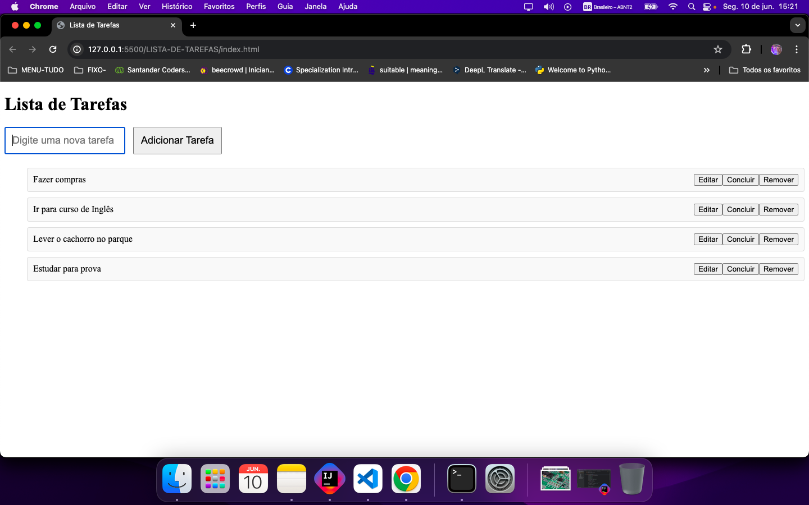
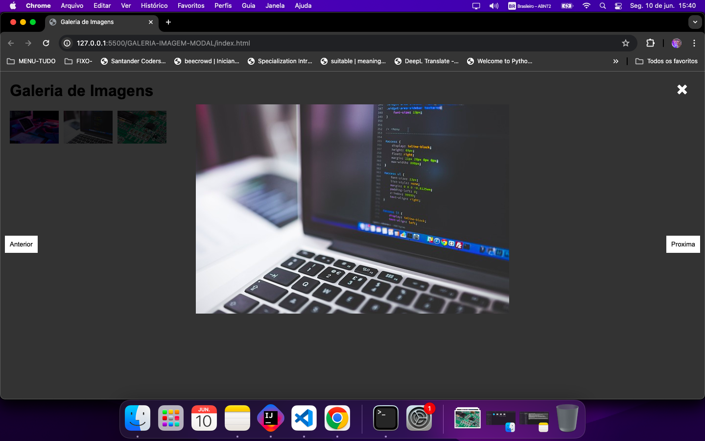
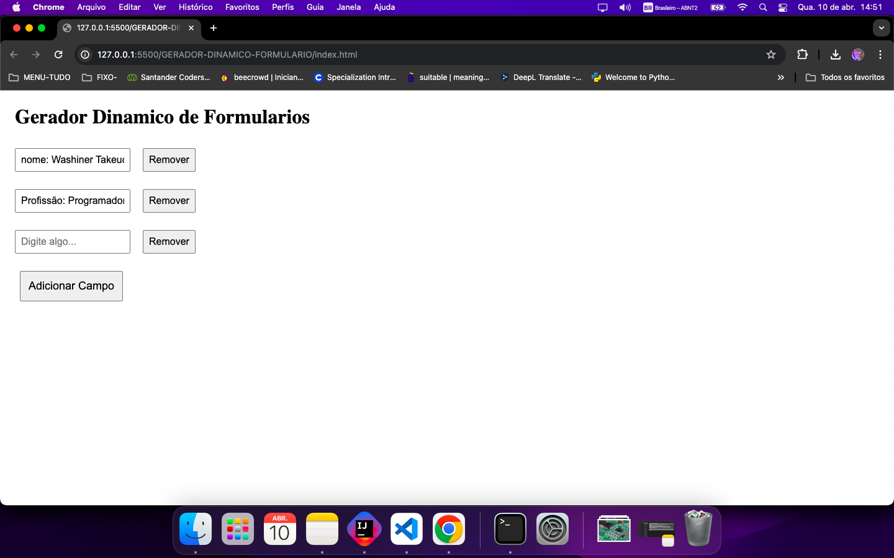
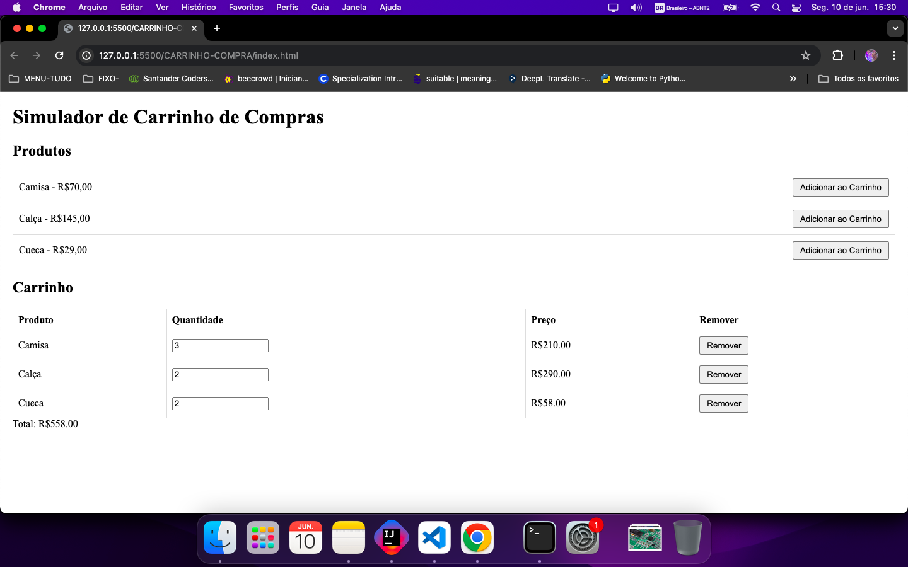
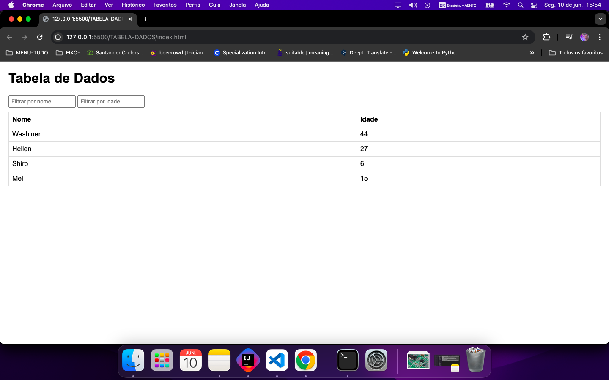

# Meus Projetos de JavaScript

Este repositório contém uma coleção de projetos simples em JavaScript que foram desenvolvidos como exemplos didáticos. Esses projetos são o resultado da atividade de JavaScript do bootcamp da Soulcode com a Sankhya. Cada projeto está separado em sua própria pasta e pode ser visualizado ao clonar este repositório e abrir os arquivos HTML em um navegador.

## Projetos

### 1. Lista de Tarefas

Este projeto é uma simples lista de tarefas onde o usuário pode adicionar, editar, marcar como concluída e remover tarefas.

### 2. Galeria de Imagens com Modal

Este projeto apresenta uma galeria de imagens onde o usuário pode clicar em uma miniatura para ver a imagem em tamanho maior em um modal. O modal também possui botões para navegar entre as imagens.

### 3. Gerador Dinâmico de Formulários

Este projeto permite ao usuário criar um formulário dinâmico adicionando e removendo campos de texto e caixas de seleção.

### 4. Simulador de Carrinho de Compras

Este projeto é um simulador de carrinho de compras onde o usuário pode adicionar itens ao carrinho, alterar quantidades e visualizar o total atualizado em tempo real.

### 5. Tabela de Dados Filtrável e Ordenável

Este projeto permite ao usuário filtrar os dados com base em critérios específicos e ordenar as colunas de forma ascendente e descendente.

